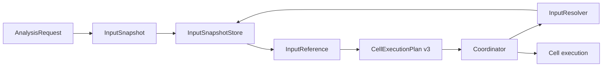

# ADR-0002: Input Reference 与 Resolver 边界

- 状态：Accepted
- 日期：2026-07-15
- 决策范围：分析输入、执行计划与多服务数据传递

## 背景

本地闭环直接把 `AnalysisRequest` 传给每个 Cell，适合早期开发，但不能直接扩展成多服务执行。历史 K 线、订单簿窗口和特征批次可能很大；如果把这些载荷复制到 `CellExecutionPlan` 或每个远程任务中，会放大序列化、网络、内存和重试成本。

同时，MarketCell 必须保留完整回放能力。用于回放的逻辑输入、用于执行寻址的轻量引用，以及 Cell 可复用的特征结果不能混成一个对象。

## 决策

### 1. 分离三种输入对象

```text
InputSnapshot   不可变的逻辑输入和完整载荷
InputReference  执行计划携带的轻量地址与完整性信息
FeatureSnapshot 独立版本化的可复用特征载荷
```

`AnalysisRun.input_snapshot` 继续保存完整 `AnalysisRequest`，作为本地回放的权威载荷。`AnalysisRun.metadata.input_snapshot_audit` 保存同一输入的身份、来源、版本、哈希和大小，但不重复 payload。

`InputSnapshot` 可以表达 `analysis_request`、`candle_batch` 或 `feature_snapshot`。`FeatureSnapshot` 使用自己的 `feature_snapshot.v1` schema 和公式版本，不依赖 ExecutionPlan 版本。

### 2. ExecutionPlan 只携带引用

`CellExecutionPlan v3` 在计划顶层保存 `input_references[]`，每个节点只保存 `input_reference_ids[]`：



ExecutionPlan 不保存 candles、events、FeatureSnapshot payload 或其他大载荷。InputReference metadata 默认不继承 Snapshot metadata，存储 adapter 如需小型定位信息必须显式提供。Graph 仍只描述组合关系，也不保存输入地址。

### 3. 输入身份是内容与来源语义的组合

`content_hash` 是 payload 的 SHA-256。参考实现使用 UTF-8、键排序、紧凑分隔符的 canonical JSON，并拒绝 NaN 和 Infinity。

`snapshot_id` 的稳定身份同时包含：

```text
input_kind
target
horizon
content_hash
data_version
source
```

`created_at` 和 metadata 不参与身份，因此同一逻辑快照可以幂等注册；相同 payload 来自不同 provider 或数据版本时则拥有不同身份。`reference_id` 从 snapshot identity 派生，URI 只表示解析位置，不充当内容真实性证明。

### 4. Resolver 必须执行完整性校验和运行内缓存

Resolver 在返回快照前校验 reference_id、snapshot_id、输入类型、payload hash、payload size、数据版本、来源、target 和 horizon。领域对象反序列化属于 Coordinator 的 input composition 阶段；这样读取完整性失败与“读取成功但无法构造成 AnalysisRequest”会被分开审计。

Coordinator 对同一个 run 中的每个 `reference_id` 最多调用一次实际 resolver，并把 AnalysisRequest 最多物化一次。后续节点读取运行内缓存，但每个节点仍生成 `input_resolution_record.v1`，明确记录成功或失败、cache hit、来源、版本以及预期/实际 hash 和 payload size。

解析失败会停止当前计划，并把已有 resolution records、plan execution 和 runtime audit 写入 failed AnalysisRun。缓存只属于一次运行，不能跨 run 隐式共享可变解析结果。

### 5. 本地实现不是分布式存储契约

`LocalInputResolver` 是内存参考实现，同时实现 `InputSnapshotStore` 和 `InputResolver`。默认 AnalysisEngine 为每个 run 创建独立本地 store，避免长生命周期进程无界保留历史 payload；显式注入的持久 store 由调用方管理生命周期。未来可以增加：

- Parquet / object storage window resolver
- Feature Store resolver
- Rust realtime state resolver
- 带签名 URL 或流句柄的远程 resolver

这些实现必须消费相同 `InputReference`，并返回通过同一完整性规则验证的 `InputSnapshot`。Cell、Graph、CellResult 和 AnalysisReport 不感知具体存储协议。

## 结果

正向结果：

- 本地单服务仍保持简单同步执行。
- 多节点共享同一输入时只发生一次实际解析和类型物化。
- 计划、队列消息和重试任务不会复制历史 K 线。
- Python 与 Rust worker 可以使用同一引用和哈希语义。
- 成功和失败运行都能解释输入来自哪里、使用哪个版本、是否命中缓存以及完整性是否通过。
- FeatureSnapshot 可以独立演进，不污染 CellResult 和 ExecutionPlan。

约束和代价：

- `AnalysisRun.input_snapshot` 当前仍保存完整回放载荷；生产级大数据回放后续需要可持久化 Snapshot Store，但不能只留下临时 URI。
- 新 resolver 必须实现内容校验，不能把“能从 URI 读到数据”当作成功。
- Planner 负责把引用分配给节点；当前参考图把分析请求引用分配给所有节点，未来可按 Graph 输入声明进一步收窄。
- canonical JSON 规则属于跨语言协议，Rust 或其他语言实现必须通过相同测试向量。

共享向量保存在 `contracts/test_vectors/input_identity_v1.json`，固定 canonical payload 的 hash、字节数、snapshot_id 和 reference_id。

## 放弃的方案

把完整 candles 放进 ExecutionPlan：计划会变成大数据载体，远程执行和重试成本不可控。

只保存 URI：底层对象被覆盖或路由错误时无法发现内容漂移。

只用 payload hash 作为 snapshot identity：相同内容来自不同数据版本或 provider 时无法区分数据血缘。

让每个 Cell 自己读取存储：会把数据访问、缓存和完整性策略分散到业务公式中，无法统一审计。
