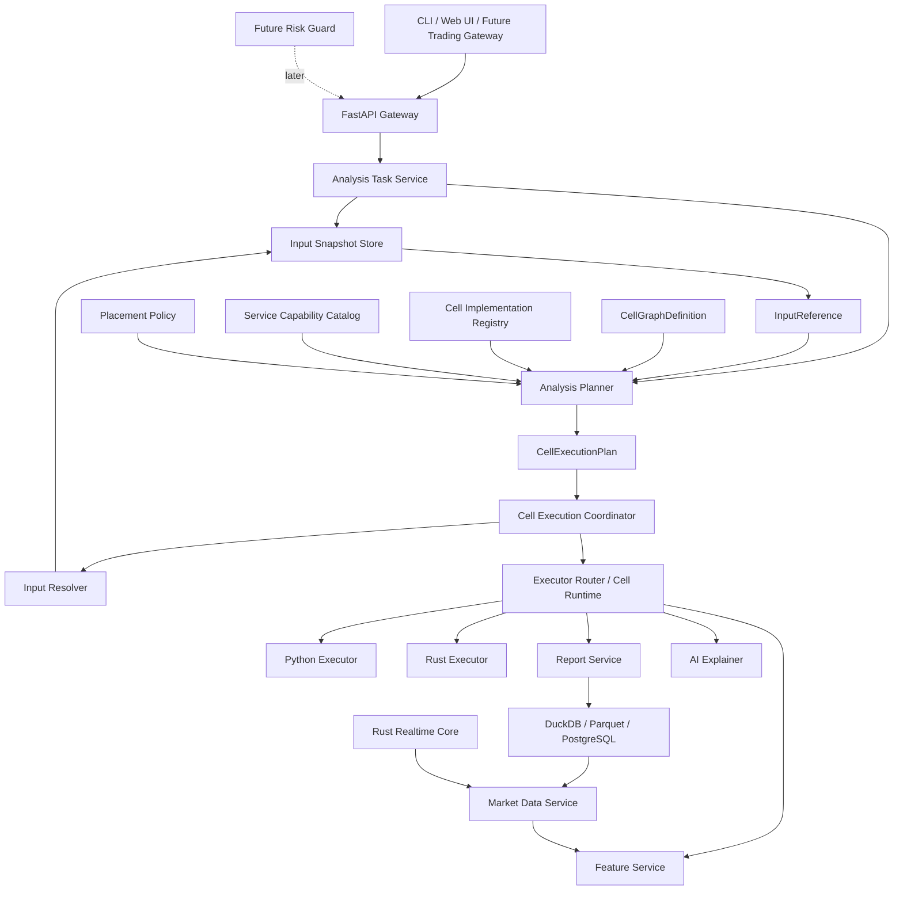
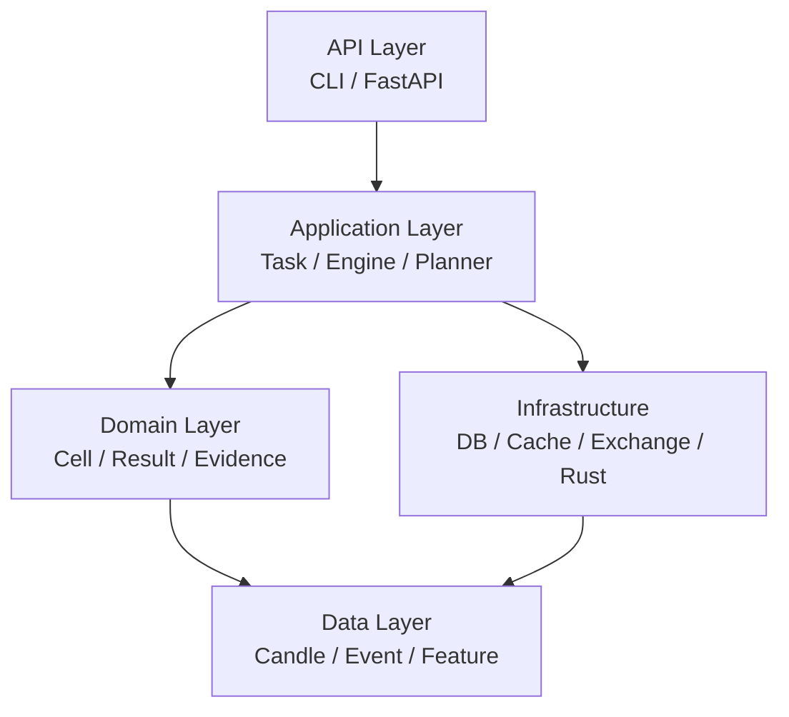
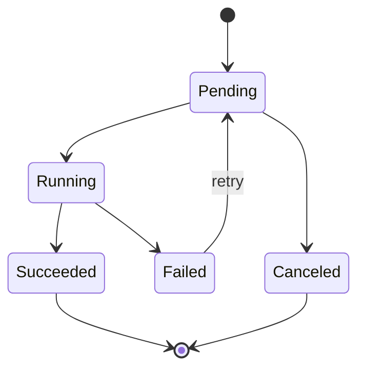
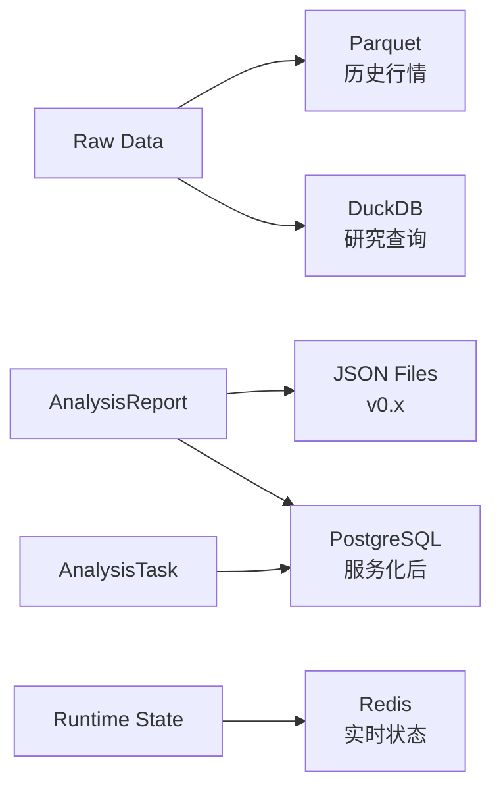

# MarketCell 后端架构文档 v1.0

## 1. 架构阶段

MarketCell 后端分三阶段演进。

### 阶段一：本地分析内核

```text
CLI + AnalysisEngine + InputSnapshot/Resolver + Graph + Planner + Validators + Coordinator + FailureControlledExecutor + LocalCellExecutor / ExecutorRouter + AnalysisRun + FileSystemReportStore
```

目标是把 Cell 协议和分析闭环做稳定。

### 阶段二：本地研究平台

```text
Python AnalysisEngine + DuckDB / Parquet + Report Store
```

目标是支持真实数据、历史回放和复盘。

### 阶段三：服务化分析系统

```text
FastAPI + Task Service + Runtime + Storage + AI + Rust Realtime Core
```

目标是支持后续界面、自动交易前置系统和实时分析。

## 2. 服务化目标架构



## 2.1 从成熟系统吸收的后端模式

后端架构需要预留这些模式：

| 模式 | 来源 | 在 MarketCell 中的用途 |
|---|---|---|
| EventBus | NautilusTrader、vn.py | 解耦数据事件、分析任务、报告事件 |
| Connector / Gateway | Hummingbot、vn.py | 接入交易所、新闻、链上、宏观数据 |
| Analyzer / Observer | Backtrader | 复盘报告、运行状态监控 |
| Recorder | Qlib | 保存每次 AnalysisRun 和公式版本 |
| ResultHandler | LEAN | 分离分析执行和报告保存 |

当前已实现轻量版：

- `EventBus`
- `AnalysisRun`
- `CellExecutionPlan`
- `CellGraphDefinition` / named Organ
- `CellGraphValidation`
- `ServiceCapabilityCatalog`
- `RuntimeAwarePlacementPolicy`
- `CellGraphValidation` / `ExecutionPlanValidation`
- `PlanDrivenLocalCoordinator`
- `InputSnapshot` / `InputReference` / `InputResolutionRecord`
- `CellInputBundle` / `OrderBookSnapshot` / `FundingOpenInterestSnapshot` / `DataProvenance`
- `LocalInputResolver` / `InputSnapshotStore`
- `CellExecutor` / `LocalCellExecutor`
- `ExecutorRouter` 和混合 capability catalog 计划入口
- `FailureControlledExecutor`、ExecutionPlan v5 fallback 和 `execution_control_record.v1`
- `PlanExecution` audit
- `CellRuntimeTrace` / `CellRuntimeSummary`
- `RuntimeSummaryStore` / `RuntimeSummarySnapshot`
- `FileSystemReportStore`
- CLI `reports`
- CLI `replay`
- `ReplayRunner`

当前不立即实现复杂消息队列。Graph、plan-driven DAG、类型化多输入组合、Input Resolver、跨运行 Runtime Summary Store、固定性能基线、Executor Router 和失败控制状态机已经完成。生产远程阶段仍需 transport adapter、跨进程幂等结果存储和强制 deadline/cancellation。

## 3. 后端分层



## 4. 后台任务模型

服务化后，分析不能只靠同步请求。

建议引入任务模型：

```text
AnalysisTask {
  task_id
  target
  horizons
  status
  created_at
  started_at
  finished_at
  input_snapshot
  report_id
  error
}
```

同时建议引入 `AnalysisRun`：

```text
AnalysisRun {
  run_id
  task_id
  engine_version
  input_hash
  input_snapshot
  input_snapshot_audit
  formula_versions
  cell_manifests
  cell_graph_definition
  cell_graph_validation
  execution_plan
  input_resolution_records
  plan_execution
  execution_control_records
  runtime_traces
  runtime_summaries
  runtime_summary_snapshot
  runtime_summary_write
  status
  started_at
  finished_at
  report_id
  error
}
```

`AnalysisTask` 关注任务状态，`AnalysisRun` 关注一次可复盘执行。

当前阶段暂不实现 `AnalysisTask`，先实现 `AnalysisRun`。

同时保留 `CellExecutionPlan`：

```text
CellExecutionPlan {
  plan_id
  target
  horizon
  root_node_id
  nodes
  node.binding_id / node.fallback_binding_ids
  input_references
  service_bindings
  schema_version
}
```

`CellExecutionPlan` 关注“本次分析如何把 Cell DAG 映射到本地或多服务执行”。当前所有 binding 都可以指向 `python-local`，未来可替换为 Python worker、Rust worker 或外部服务。

原因：

```text
本地 CLI 阶段没有异步任务队列
但已经需要记录每次分析如何产生报告
```

任务状态：



## 5. 后端 API 草案

后期服务化接口：

```text
POST /analysis/run
GET  /analysis/{task_id}
GET  /analysis/{task_id}/report
GET  /cells
GET  /cells/{cell_id}
GET  /reports/{report_id}
POST /replay/{report_id}
GET  /replay/{report_id}/diff
```

第一阶段不实现这些接口，只作为架构目标。

## 6. 数据存储规划



阶段选择：

- 当前：本地 JSON Report / Run、可选 Parquet / DuckDB 行情存储。
- 本地研究平台：增强 Parquet 查询、upsert、运行性能历史。
- 服务化阶段：PostgreSQL 保存任务和运行审计。
- 实时集群阶段：Redis 或专用状态存储只保存短期运行状态。

## 7. Python 与 Rust 协作方式

短期不做跨语言复杂集成。

中期可选方案：

| 方式 | 适用场景 |
|---|---|
| 文件交换 | 批量计算结果、Parquet 历史缓存 |
| 子进程 | 简单高性能任务 |
| HTTP 服务 | 独立实时服务 |
| 消息队列 | 数据流和任务流 |
| PyO3 | 性能热点函数 |

建议顺序：

```text
先 Python
再用 Rust 稳定动态数据和热点原语
最后只把证明有效的热点嵌入 Python 或服务化
```

## 8. 可观测性规划

当前已经记录：

- run_id / plan_id / trace_id / span_id
- cell_id
- formula_version
- input_hash
- input_snapshot_id / input_reference_id
- input source / data_version / resolution status / cache_hit
- implementation_id / service_id / runtime
- duration_ms / status / error / retry_count
- idempotency_key / attempt_id / failure_kind / fallback_count
- timeout budget / cancellation / admission result
- report_id

后续服务化再增加：

- task_id
- queue_wait_ms
- service health / concurrency / capacity
- OpenTelemetry 跨进程上下文

这会决定系统能不能复盘。

## 9. 部署演进

```text
本地 CLI
→ 本地服务
→ 单机 API + 数据库
→ 分析任务队列
→ 实时数据服务
→ 自动交易前置系统
```

不要在早期做复杂微服务。

## 10. 架构风险

- 太早服务化会拖慢核心模型设计。
- 太早接自动交易会污染分析边界。
- 太早引入复杂数据库会增加维护成本。
- 太晚定义数据契约会导致 Cell 输出混乱。
- 太晚做回放会导致历史判断不可验证。
- ExecutionPlan 如果长期只用于审计而不驱动执行，会出现计划拓扑和真实顺序分裂。
- Input Reference 已避免计划复制大体积 K 线；下一风险是生产 Snapshot Store、权限、生命周期和跨服务数据局部性尚未落地。
