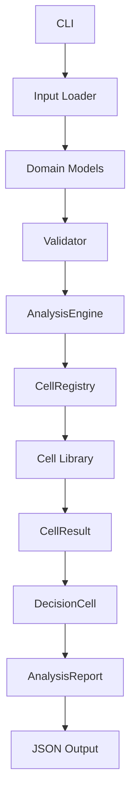
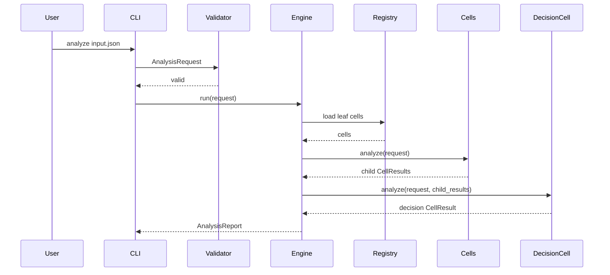

# MarketCell 后端设计文档 v0.1

## 1. 后端目标

MarketCell 后端第一阶段只做分析闭环：

```text
读取输入
校验数据
执行 Cell
聚合结果
输出报告
```

暂时不做：

- Web 页面
- 用户系统
- 自动交易
- 真实数据爬虫
- 多租户部署

## 2. 后端模块边界



## 3. 当前模块职责

| 模块 | 职责 |
|---|---|
| `cli.py` | 命令行入口，负责读取文件和输出 JSON |
| `models.py` | 定义核心数据结构 |
| `events.py` | 轻量事件总线，记录分析开始、Cell 完成、报告保存等事件 |
| `runs.py` | 定义 AnalysisRun，记录一次可复盘分析运行 |
| `validation.py` | 校验输入数据 |
| `registry.py` | 注册和列出 Cell |
| `engine.py` | 编排一次分析任务 |
| `scoring.py` | 评分和方向转换 |
| `policies/` | 可替换策略，例如决策权重、风险分层和行动姿态 |
| `reports/` | 报告保存、读取和列表查询 |
| `replay/` | 基于保存的 input snapshot 重新执行分析，并比较结果漂移 |
| `data/` | K 线数据源协议、质量检查、质量监控、路由、缓存和可选 Parquet/DuckDB 存储适配 |
| `features/` | K 线基础特征快照和版本化计算 |
| `cells/` | 具体分析 Cell |
| `contracts/` | 跨语言共享 JSON Schema 契约，位于仓库根目录 |

## 4. 后端核心流程



## 5. 第一阶段命令

分析一个输入文件：

```bash
PYTHONPATH=packages/python/src python3 -m market_cell analyze examples/btc_usd_sample.json --pretty
```

查看当前 Cell：

```bash
PYTHONPATH=packages/python/src python3 -m market_cell cells --pretty
```

保存分析报告：

```bash
PYTHONPATH=packages/python/src python3 -m market_cell analyze examples/btc_usd_sample.json --save --pretty
```

列出已保存报告：

```bash
PYTHONPATH=packages/python/src python3 -m market_cell reports --pretty
```

回放报告并比较当前公式结果：

```bash
PYTHONPATH=packages/python/src python3 -m market_cell replay <report_id> --pretty
```

只查看已保存报告：

```bash
PYTHONPATH=packages/python/src python3 -m market_cell replay <report_id> --stored-only --pretty
```

## 6. 后端扩展顺序

建议按这个顺序扩展：

1. 报告保存和回放比较：`reports/`、`replay/`
2. 多周期输入：`MultiHorizonRequest`
3. 本地数据读取：CSV / JSON / Parquet
4. 数据缓存：DuckDB
5. 服务接口：FastAPI
6. 后台任务：任务 ID、状态、结果查询
7. AI 解释：对 AnalysisReport 做二次解释
8. 实时模块：Rust 或独立服务

## 7. 错误处理原则

- 输入错误在 `validation.py` 处理。
- Cell 内部不要吞掉严重错误。
- 可解释的业务异常要进入报告。
- 数据结构错误要直接失败。
- 后期服务化后，错误需要分类为 validation、runtime、data_source、cell_failure。

## 8. 配置原则

第一阶段不引入复杂配置系统。

后期配置来源：

```text
默认配置
项目配置文件
环境变量
命令行参数
```

敏感信息只允许来自环境变量或密钥管理系统。

## 9. 后端设计底线

- Cell 不能直接操作全局状态。
- Cell 不能直接下单。
- Cell 不能绕过标准输出结构。
- Engine 不能写死所有未来逻辑。
- 数据校验不能交给单个 Cell。
- 跨语言模块必须遵守 `contracts/`，不能私自复制一套不兼容模型。
