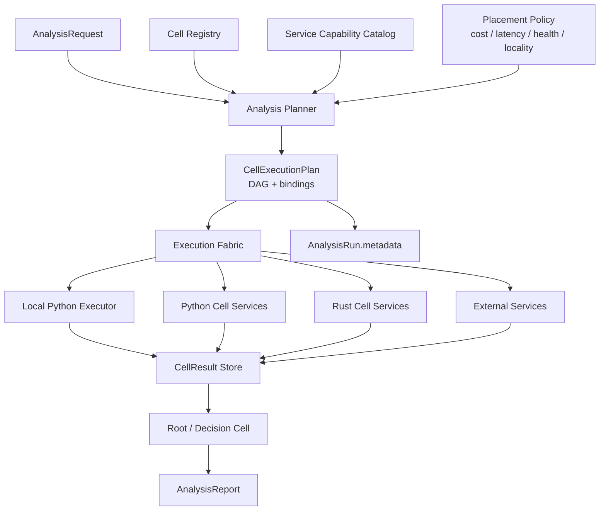
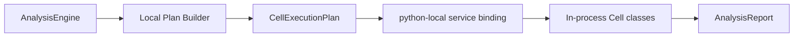
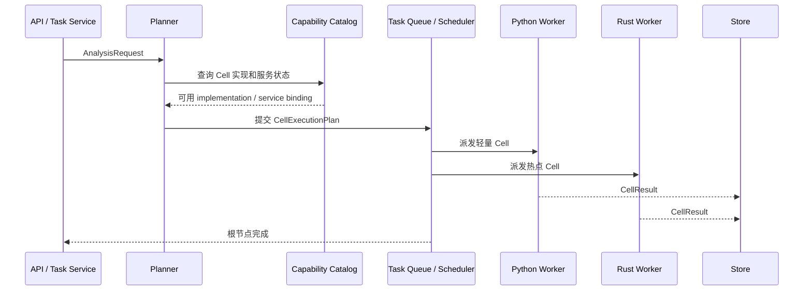

# MarketCell Cell Execution Fabric v0.1

## 1. 为什么需要 Execution Fabric

MarketCell 的 Cell 不是普通函数，也不是固定本地类。

一个 Cell 可以很轻，也可以背后包含复杂特征计算、机器学习推理、跨市场数据查询、链上聚合或 Rust 热路径计算。多个 Cell 组合后，应该像器官系统一样协同工作：

```text
Cell          最小分析能力
Organ         一组 Cell 形成的局部分析系统
Organ System  多个 Organ 组成完整市场分析流程
Fabric        负责把这些能力映射到本地或多服务集群执行
```

所以地基不能只支持：

```text
Python 进程内按固定列表顺序执行 Cell
```

它必须提前支持：

- 一个 Cell 可以有多个服务实现。
- 一个服务可以承载多个 Cell。
- 一个 Cell 可以根据输入规模、实时性、成本和可用性切换执行位置。
- 当前只有本地单服务也能工作。
- 后续扩展到多服务集群时，Cell 协议和报告协议不需要推倒重来。

## 2. 成熟系统吸收点

MarketCell 不照搬通用工作流平台，但吸收它们经过验证的结构。

| 系统 | 值得吸收 | MarketCell 落点 |
|---|---|---|
| Temporal | Workflow / Activity 分离，Worker 从 Task Queue 拉任务 | CellExecutionPlan 只描述任务图，具体服务通过 service binding 执行 |
| Dask | 计算图和 Scheduler 解耦，同一图可由不同 scheduler 执行 | Cell DAG 不绑定本地、线程池或服务集群 |
| Ray | Task / Actor 区分，资源提示驱动调度 | Cell 可区分 stateless / stateful，并声明 CPU、延迟、并发提示 |
| Kubernetes | Service 名称稳定，Pod / endpoint 可变 | Cell 绑定 service_id，不绑定瞬时进程或 IP |
| OpenTelemetry | Trace / Span 跨进程传播，形成因果链 | 每个 Cell 执行节点后续要形成可追踪 span |

关键结论：

```text
Cell 是能力契约，不是执行位置。
Service 是承载能力的运行实体，不是业务语义。
ExecutionPlan 是本次分析的计算图，不是固定引擎实现。
```

## 3. 总体设计



## 4. 核心对象

### 4.1 Cell Manifest

Cell Manifest 描述能力：

```text
cell_id
category
inputs
outputs
formula_version
risk_dimensions
status
```

Manifest 不描述它跑在哪个服务上。

### 4.2 Cell Implementation

Cell Implementation 描述某个 Cell 的一个可执行实现：

```text
implementation_id
cell_id
formula_version
runtime
language
resource_hints
capabilities
```

同一个 `cell_id` 可以有多个 implementation：

```text
technical.trend
├── python-local:technical.trend:trend_close_change_v0.1
├── python-service-fast:technical.trend:trend_close_change_v0.1
└── rust-service-hot:technical.trend:trend_close_change_v0.1
```

### 4.3 Cell Service Binding

Service Binding 描述某个实现当前由哪个服务承载：

```text
implementation_id
service_id
runtime
endpoint
task_queue
priority
supports_batch
max_concurrency
```

一个服务可以承载多个 Cell：

```text
python-market-structure-service
├── technical.trend
├── technical.volume
└── technical.market_regime
```

一个 Cell 也可以由多个服务承载：

```text
risk.manipulation
├── python-local fallback
├── rust-low-latency service
└── external-ml service
```

### 4.4 Cell Execution Plan

ExecutionPlan 描述本次分析实际要执行的 DAG：

```text
plan_id
target
horizon
nodes
dependencies
service_bindings
root_node_id
metadata
```

它应该能表达：

- 哪些 Cell 可并行执行。
- 哪些 Cell 依赖其他 Cell 输出。
- 哪个节点优先使用哪个 implementation。
- 本次计划落在本地单服务，还是未来的多服务集群。

### 4.5 Cell Runtime Trace

每个节点执行都应该产生 runtime trace：

```text
run_id
plan_id
node_id
cell_id
implementation_id
service_id
status
started_at
finished_at
duration_ms
retry_count
error
trace_id
span_id
```

当前本地 `AnalysisEngine` 已经为每个 Cell 节点生成 `cell_runtime_trace.v1` 记录，并写入 `AnalysisRun.metadata.cell_runtime_traces`。未来远程 worker 也必须上报同一类记录。

## 5. 单服务和多服务如何兼容

### 5.1 当前本地单服务



当前阶段所有 Cell 都可以绑定到：

```text
service_id = python-local
runtime = python_local
task_queue = cell.python-local
endpoint = null
```

这意味着本地测试不需要服务发现、消息队列或 Kubernetes。

### 5.2 未来多服务集群



多服务时，ExecutionPlan 不变；变化的是：

- bindings 来自服务发现或能力目录。
- executor 从本地循环变成调度器。
- CellResult 从内存列表变成结果存储或消息返回。

## 6. 调度策略

调度不应该写死在 Cell 内部。

Placement Policy 可以根据这些条件选择实现：

| 条件 | 示例 |
|---|---|
| 输入规模 | 大量历史 K 线走批处理服务 |
| 延迟要求 | 实时分析优先 Rust 服务 |
| 资源开销 | heavy CPU Cell 派到独立 worker |
| 服务健康 | 降级到本地 fallback |
| 数据局部性 | 靠近 Feature Store 的服务优先 |
| 成本 | 非实时任务避开昂贵资源 |

## 7. 边界和禁忌

Cell 不能直接决定自己跑在哪个服务。

Service 不能改变 CellResult 协议。

ExecutionPlan 不能包含大体积市场数据，只引用输入键、特征键、依赖和绑定。

AnalysisReport 不能混入调度细节。

AnalysisRun 可以保存 ExecutionPlan 和后续 runtime trace，用于复盘和性能分析。

## 8. 当前落地顺序

当前只做地基，不上复杂集群：

1. 定义 `CellExecutionPlan` JSON Schema。
2. 实现 Python 本地 `build_local_execution_plan`。
3. 把 execution plan 写入 `AnalysisRun.metadata`。
4. 定义 `CellRuntimeTrace` JSON Schema，并记录本地每个 Cell 节点的耗时、状态和服务归属。
5. 再考虑 Task Queue、服务发现、远程执行。

## 9. 官方参考

- Temporal Task Queues: https://docs.temporal.io/task-queue
- Temporal Workers: https://docs.temporal.io/workers
- Dask Task Graphs: https://docs.dask.org/en/latest/graphs.html
- Dask Distributed Scheduler: https://distributed.dask.org/
- Ray Core: https://docs.ray.io/en/latest/ray-core/walkthrough.html
- Ray Actors: https://docs.ray.io/en/latest/ray-core/actors.html
- Kubernetes Service: https://kubernetes.io/docs/concepts/services-networking/service/
- Kubernetes DNS for Services and Pods: https://kubernetes.io/docs/concepts/services-networking/dns-pod-service/
- OpenTelemetry Traces: https://opentelemetry.io/docs/concepts/signals/traces/
