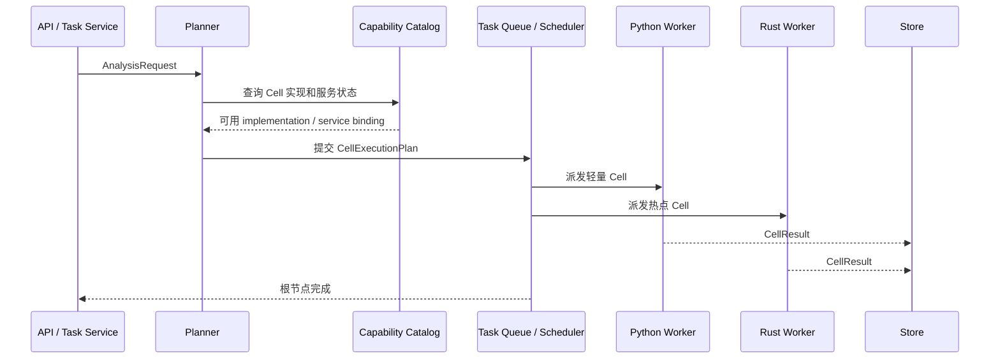

# MarketCell Cell Execution Fabric v0.2

## 1. 为什么需要 Execution Fabric

MarketCell 的 Cell 不是普通函数，也不是固定本地类。

一个 Cell 可以很轻，也可以背后包含复杂特征计算、机器学习推理、跨市场数据查询、链上聚合或 Rust 热路径计算。多个 Cell 组合后，应该像器官系统一样协同工作：

```text
Cell          最小分析能力
Organ         一组 Cell 形成的局部分析系统
Organ System  多个 Organ 组成完整市场分析流程
Fabric        负责把这些能力映射到本地或多服务集群执行
```

所以地基不能只支持：

```text
Python 进程内按固定列表顺序执行 Cell
```

它必须提前支持：

- 一个 Cell 可以有多个服务实现。
- 一个服务可以承载多个 Cell。
- 一个 Cell 可以根据输入规模、实时性、成本和可用性切换执行位置。
- 当前只有本地单服务也能工作。
- 后续扩展到多服务集群时，Cell 协议和报告协议不需要推倒重来。

## 2. 成熟系统吸收点

MarketCell 不照搬通用工作流平台，但吸收它们经过验证的结构。

| 系统 | 值得吸收 | MarketCell 落点 |
|---|---|---|
| Temporal | Workflow / Activity 分离，Worker 从 Task Queue 拉任务 | CellExecutionPlan 只描述任务图，具体服务通过 service binding 执行 |
| Dask | 计算图和 Scheduler 解耦，同一图可由不同 scheduler 执行 | Cell DAG 不绑定本地、线程池或服务集群 |
| Ray | Task / Actor 区分，资源提示驱动调度 | Cell 可区分 stateless / stateful，并声明 CPU、延迟、并发提示 |
| Kubernetes | Service 名称稳定，Pod / endpoint 可变 | Cell 绑定 service_id，不绑定瞬时进程或 IP |
| OpenTelemetry | Trace / Span 跨进程传播，形成因果链 | 每个 Cell 执行节点后续要形成可追踪 span |

关键结论：

```text
Cell 是能力契约，不是执行位置。
Service 是承载能力的运行实体，不是业务语义。
ExecutionPlan 是本次分析的计算图，不是固定引擎实现。
```

## 3. 总体设计

```mermaid
flowchart TB
    Request["AnalysisRequest"] --> Planner["Analysis Planner"]
    Registry["Cell Registry"] --> Planner
    Catalog["Service Capability Catalog"] --> Planner
    Policy["Placement Policy<br/>cost / latency / health / locality"] --> Planner

    Planner --> Plan["CellExecutionPlan<br/>DAG + bindings"]
    Plan --> Executor["Execution Fabric"]

    Executor --> Local["Local Python Executor"]
    Executor --> PySvc["Python Cell Services"]
    Executor --> RustSvc["Rust Cell Services"]
    Executor --> ExtSvc["External Services"]

    Local --> Results["CellResult Store"]
    PySvc --> Results
    RustSvc --> Results
    ExtSvc --> Results

    Results --> Root["Root / Decision Cell"]
    Root --> Report["AnalysisReport"]
    Plan --> Run["AnalysisRun.metadata"]
```



## 4. 核心对象

### 4.1 Cell Manifest

Cell Manifest 描述能力：

```text
cell_id
category
inputs
outputs
formula_version
risk_dimensions
status
```

Manifest 不描述它跑在哪个服务上。

### 4.2 Cell Implementation

Cell Implementation 描述某个 Cell 的一个可执行实现：

```text
implementation_id
cell_id
formula_version
runtime
language
resource_hints
capabilities
```

同一个 `cell_id` 可以有多个 implementation：

```text
technical.trend
├── python-local:technical.trend:trend_close_change_v0.1
├── python-service-fast:technical.trend:trend_close_change_v0.1
└── rust-service-hot:technical.trend:trend_close_change_v0.1
```

### 4.3 Service Capability Catalog

Capability Catalog 是 planner 的候选实现输入，而不是临时连接对象集合：

```text
catalog_id
generated_at
bindings[]
schema_version
metadata
```

它允许一个 Cell 对应多个服务，也允许一个服务承载多个 Cell；同一 implementation 也可以部署到多个逻辑服务。当前目录由本地 Registry 构建；未来可以由静态配置、控制面或服务发现生成，但输出都必须遵守 `service_capability_catalog.v2`。

### 4.4 Cell Service Binding

Service Binding 描述某个实现当前由哪个服务承载：

```text
binding_id
implementation_id
service_id
runtime
endpoint
task_queue
priority
supports_batch
max_concurrency
```

`binding_id` 是 implementation 与逻辑 service 的稳定组合身份，节点必须显式引用它。跨语言统一生成公式为 `binding:{service_id}:{implementation_id}`，不允许各 runtime 自定义另一套算法。

一个服务可以承载多个 Cell：

```text
python-market-structure-service
├── technical.trend
├── technical.volume
└── technical.market_regime
```

一个 Cell 也可以由多个服务承载：

```text
risk.manipulation
├── python-local fallback
├── rust-low-latency service
└── external-ml service
```

### 4.5 Cell Placement Decision

Placement Decision 记录 planner 对每个 Cell 的实际选择：

```text
cell_id
formula_version
selected_implementation_id
selected_service_id
policy
reason_codes
candidate_evaluations
```

候选评估区分 `no_history / insufficient_history / healthy / unhealthy`，并保留 trace 数量、失败率和 P95 延迟。这样调度结论可以复盘，而不是只看到最终 binding。

### 4.6 Cell Execution Plan

ExecutionPlan 描述本次分析实际要执行的 DAG：

```text
plan_id
target
horizon
nodes
dependencies
service_bindings
root_node_id
metadata
```

v2 中 `node_id` 是执行身份，`cell_id` 是能力身份。同一个 Cell 可以在图中出现多次，但每个节点必须有唯一 node_id，并通过 binding_id 指向明确服务。

它应该能表达：

- 哪些 Cell 可并行执行。
- 哪些 Cell 依赖其他 Cell 输出。
- 哪个节点优先使用哪个 implementation。
- 本次计划落在本地单服务，还是未来的多服务集群。

### 4.7 Cell Runtime Trace

每个节点执行都应该产生 runtime trace：

```text
run_id
plan_id
node_id
cell_id
implementation_id
service_id
status
started_at
finished_at
duration_ms
retry_count
error
trace_id
span_id
```

当前本地 `AnalysisEngine` 已经为每个 Cell 节点生成 `cell_runtime_trace.v1` 记录，并写入 `AnalysisRun.metadata.cell_runtime_traces`。未来远程 worker 也必须上报同一类记录。

### 4.8 Cell Runtime Summary

Runtime summary 是 trace 的聚合层：

```text
cell_id
formula_version
implementation_id
service_id
runtime
trace_count
succeeded_count
failed_count
skipped_count
average_duration_ms
max_duration_ms
min_duration_ms
p95_duration_ms
error_count
retry_count
```

当前本地 `AnalysisEngine` 已经生成 `cell_runtime_summary.v1`，并写入 `AnalysisRun.metadata.cell_runtime_summaries`。它按 Cell、公式版本、实现、服务和运行时聚合，后续用于：

- 找出高延迟或高失败率 Cell。
- 判断哪些 Cell 需要迁移到 Rust 热路径或独立 worker。
- 给 placement policy 提供历史性能输入。
- 做 CI 或离线回放中的性能回归检测。

它不改变 `CellResult` 和 `AnalysisReport`，只服务于运行审计、调度优化和容量规划。

## 5. 单服务和多服务如何兼容

### 5.1 当前本地单服务


当前阶段所有 Cell 都可以绑定到：

```text
service_id = python-local
runtime = python_local
task_queue = cell.python-local
endpoint = null
```

这意味着本地测试不需要服务发现、消息队列或 Kubernetes。

### 5.2 未来多服务集群



多服务时，ExecutionPlan 不变；变化的是：

- bindings 来自服务发现或能力目录。
- executor 从本地循环变成调度器。
- CellResult 从内存列表变成结果存储或消息返回。

## 6. 调度策略

调度不应该写死在 Cell 内部。

Placement Policy 可以根据这些条件选择实现：

| 条件 | 示例 |
|---|---|
| 输入规模 | 大量历史 K 线走批处理服务 |
| 延迟要求 | 实时分析优先 Rust 服务 |
| 资源开销 | heavy CPU Cell 派到独立 worker |
| 服务健康 | 降级到本地 fallback |
| 数据局部性 | 靠近 Feature Store 的服务优先 |
| 成本 | 非实时任务避开昂贵资源 |

当前参考策略 `runtime_aware_priority_v0.1` 使用稳定、确定性的最小规则：

1. 只接受 `cell_id + formula_version` 完全匹配的候选。
2. 当样本达到阈值时，把失败率超过阈值的实现移出健康候选池。
3. 健康候选按较小的 `priority` 值优先。
4. 同优先级下，优先选择有足够历史且 P95 延迟更低的实现。
5. 所有候选都不健康时仍返回最小风险 fallback，同时明确记录原因。

未知服务不会仅凭一次快测就被判定健康或故障，避免小样本抖动直接改变服务放置。

## 7. 边界和禁忌

Cell 不能直接决定自己跑在哪个服务。

Service 不能改变 CellResult 协议。

ExecutionPlan 不能包含大体积市场数据，只引用输入键、特征键、依赖和绑定。

AnalysisReport 不能混入调度细节。

AnalysisRun 可以保存 ExecutionPlan、runtime trace 和 runtime summary，用于复盘、性能分析和后续调度优化。

本地 `LocalCellExecutor` 已经在执行前校验 node、formula、implementation、service、runtime 和 language。远程 binding 会被拒绝，且 Cell 不会被调用；失败 trace 记录本地 executor 和原计划服务，避免把拒绝调度误记成远程执行。成功后引擎会再次校验 trace 与 plan，并校验 CellResult 的 cell_id、target 和 horizon。

Cell 执行异常时，`FileSystemReportStore.save_run` 会单独保存 failed AnalysisRun，包括已完成 trace、失败 trace 和 runtime summary；保存运行记录失败时只写入 `analysis.failed.persistence_error`，不会覆盖原始 Cell 异常。

## 8. 当前状态和进入集群前的门槛

计划、binding、catalog、placement、executor、trace、summary 和 Plan Validator 已有本地参考实现。

进入远程执行前还必须完成：

- plan-driven coordinator。
- Input Reference / Resolver。
- 跨运行性能历史。
- Executor Router。
- 幂等、超时、重试、背压和取消语义。

具体实施顺序只以 `roadmap.md` 为准。

## 9. 官方参考

- Temporal Task Queues: https://docs.temporal.io/task-queue
- Temporal Workers: https://docs.temporal.io/workers
- Dask Task Graphs: https://docs.dask.org/en/latest/graphs.html
- Dask Distributed Scheduler: https://distributed.dask.org/
- Ray Core: https://docs.ray.io/en/latest/ray-core/walkthrough.html
- Ray Actors: https://docs.ray.io/en/latest/ray-core/actors.html
- Kubernetes Service: https://kubernetes.io/docs/concepts/services-networking/service/
- Kubernetes DNS for Services and Pods: https://kubernetes.io/docs/concepts/services-networking/dns-pod-service/
- OpenTelemetry Traces: https://opentelemetry.io/docs/concepts/signals/traces/
