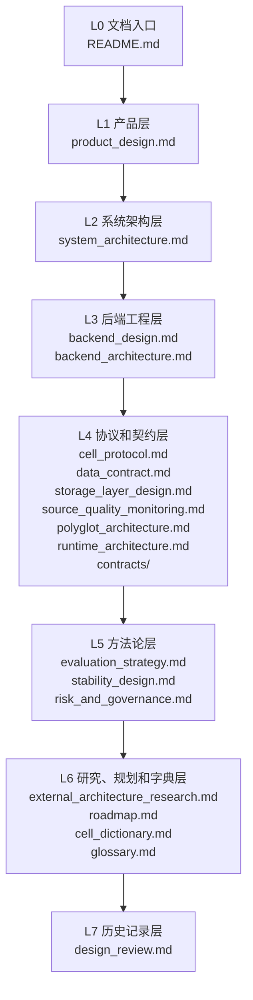

# MarketCell 文档架构与闭环关系 v0.1

## 1. 这份文档解决什么问题

MarketCell 是复杂系统，如果文档只是散开的说明文件，后期会越来越难维护。

这份文档定义：

- 文档层级
- 阅读路径
- 文档之间的闭环关系
- 哪类问题应该写到哪份文档
- 后续文档如何扩展

## 2. 文档分层



## 3. 文档闭环

MarketCell 文档必须形成这个闭环：


闭环含义：

- 产品目标决定架构方向。
- 架构方向决定后端模块。
- 后端模块必须遵守协议和数据契约。
- 代码实现必须可测试。
- 测试结果和真实复盘会反过来修正路线图。
- 路线图再反过来修正产品目标。

## 4. 当前闭环检查

| 闭环环节 | 对应文档 | 当前状态 |
|---|---|---|
| 为什么做 | `product_design.md` | 已有 |
| 系统怎么长大 | `system_architecture.md` | 已有 |
| 后端怎么组织 | `backend_design.md` | 已有 |
| 后端未来怎么服务化 | `backend_architecture.md` | 已有 |
| 多语言怎么协作 | `polyglot_architecture.md`, `contracts/` | 已有 |
| 冷热运行时怎么分工 | `runtime_architecture.md` | 已补 |
| Cell 怎么写 | `cell_protocol.md` | 已有 |
| 数据怎么传 | `data_contract.md` | 已有 |
| 行情怎么缓存和查询 | `storage_layer_design.md` | 已补 |
| 数据源质量怎么监控 | `source_quality_monitoring.md` | 已补 |
| Cell 怎么评估 | `evaluation_strategy.md` | 已补 |
| 三个核心稳定性怎么守住 | `stability_design.md` | 已有 |
| 风险边界是什么 | `risk_and_governance.md` | 已有 |
| 别人的成熟架构有什么能吸收 | `external_architecture_research.md` | 已补 |
| 先做什么后做什么 | `roadmap.md` | 已有 |
| 术语怎么统一 | `glossary.md` | 已补 |

结论：

```text
文档主闭环已经形成。
```

但后续随着真实数据、AI 解释、自动交易接入，还需要继续补充专项文档。

## 5. 写文档的归属规则

### 产品目标变化

写到：

```text
product_design.md
roadmap.md
```

### 架构层变化

写到：

```text
system_architecture.md
backend_architecture.md
polyglot_architecture.md
runtime_architecture.md
```

### 后端模块变化

写到：

```text
backend_design.md
```

### 数据结构变化

写到：

```text
data_contract.md
contracts/
```

同时检查：

```text
cell_protocol.md
system_architecture.md
```

### 新增 Cell

必须更新：

```text
cell_protocol.md
cell_dictionary.md
tests
```

如果是重要 Cell，还要更新：

```text
product_design.md
system_architecture.md
evaluation_strategy.md
```

### 风险边界变化

写到：

```text
risk_and_governance.md
```

如果影响自动交易，再同步：

```text
backend_architecture.md
```

## 6. 后续建议补充的专项文档

不是现在必须写，但后期一定会需要：

| 文档 | 触发时机 |
|---|---|
| `data_source_strategy.md` | 开始接真实交易所、新闻、链上数据时 |
| `factor_graph_design.md` | 开始实现因子图时 |
| `multi_horizon_design.md` | 开始做多周期分析时 |
| `ai_explainer_design.md` | 开始接 AI 解释层时 |
| `trading_gateway_design.md` | 开始做自动交易前置系统时 |
| `adr/` | 出现重大技术取舍时 |

## 7. 当前最重要的文档优先级

近期优先维护：

1. `cell_protocol.md`
2. `data_contract.md`
3. `evaluation_strategy.md`
4. `external_architecture_research.md`
5. `roadmap.md`

原因是下一步要继续写 Cell，这几份文档会直接约束代码质量。
