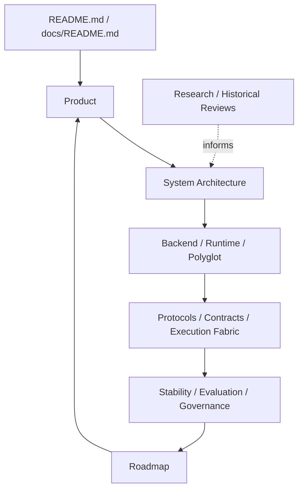

# MarketCell 文档治理 v0.2

## 1. 目标

MarketCell 文档需要像代码一样有明确所有权，避免同一架构、字段或路线在多处重复维护后互相矛盾。

文档治理遵守：

```text
一个问题只有一个权威来源。
总览文档只保留边界和导航。
专项文档保存细节。
路线图只维护一份。
历史记录不能继续充当当前计划。
```

## 2. 文档分层



## 3. 权威来源矩阵

| 问题 | 唯一权威来源 | 其他文档的处理方式 |
|---|---|---|
| 产品定位、用户、边界 | `product_design.md` | 只链接，不复制产品路线 |
| 当前系统基线 | `system_architecture.md` | 专项文档补细节 |
| 后端模块和服务化 | `backend_design.md`, `backend_architecture.md` | 系统架构只保留边界 |
| Cell 开发要求 | `cell_protocol.md` | Cell 字典只列能力 |
| Cell 多服务执行 | `cell_execution_fabric.md` | Runtime 文档只讲语言职责 |
| Python / Rust 分工 | `runtime_architecture.md` | Polyglot 文档只讲仓库和契约 |
| 字段和 schema | `data_contract.md`, `contracts/` | 示例必须引用同一版本 |
| 数据源和质量 | 对应 data 专项文档 | 系统架构只说明层次 |
| 稳定性要求 | `stability_design.md` | 测试清单与其同步 |
| 评估方法 | `evaluation_strategy.md` | 产品文档只描述成功标准 |
| 实施顺序和版本 | `roadmap.md` | 其他文档不得维护独立版本清单 |
| 历史决策过程 | `design_review.md`, `external_architecture_research.md` | 明确标记为历史或研究输入 |
| 重要技术取舍 | `docs/adr/` | 触发时新增 ADR |

## 4. 文档闭环

```text
产品目标
→ 系统边界
→ 专项设计
→ 跨语言契约
→ 代码实现
→ 测试和运行证据
→ 稳定性与评估
→ 路线图调整
```

任何实现变更至少检查：

- 是否改变公共字段或 schema。
- 是否改变层次、依赖方向或运行位置。
- 是否改变失败、降级或风险语义。
- 是否改变实施顺序。
- 是否需要 ADR。

## 5. 变更归属规则

### 新增或修改契约

同步更新：

- `contracts/`
- `data_contract.md`
- 对应语言模型
- 契约测试

### 修改执行架构

同步更新：

- `cell_execution_fabric.md`
- `runtime_architecture.md`
- `system_architecture.md` 中的当前基线
- execution 测试

### 新增 Cell

同步更新：

- `cell_protocol.md` 要求检查
- `cell_dictionary.md`
- 单元测试和验证样例
- 公式版本和误判记录

### 修改产品或风险语义

同步更新：

- `product_design.md` 或 `risk_and_governance.md`
- `stability_design.md`
- 对应结构化字段和测试

### 修改实施顺序

只修改 `roadmap.md`。其他文档引用 roadmap，不复制版本列表。

## 6. 文档状态

文档应区分：

- `baseline`：当前权威设计。
- `proposal`：尚未决定的方案。
- `historical`：保留背景，不再指导实施。
- `reference`：外部资料或字典。

当前：

- `system_architecture.md` 是 baseline。
- `roadmap.md` 是 baseline。
- `design_review.md` 是 historical。
- `external_architecture_research.md` 是 reference。

## 7. ADR 触发条件

出现以下变化时应新增 ADR，而不是只在长文档里修改一句：

- 引入消息队列、服务发现或新的数据库类型。
- 修改 CellResult、AnalysisReport 等核心契约的大版本。
- 选择远程执行协议。
- 改变 Python / Rust 职责边界。
- 引入幂等、重试或一致性模型。
- 改变 Graph / Organ 的核心表示。

## 8. 当前文档维护优先级

地基阶段优先维护：

1. `system_architecture.md`
2. `cell_execution_fabric.md`
3. `data_contract.md` 和 `contracts/`
4. `stability_design.md`
5. `runtime_architecture.md`
6. `roadmap.md`

业务 Cell 扩展阶段再提高 `cell_protocol.md`、`cell_dictionary.md` 和 `evaluation_strategy.md` 的维护频率。
