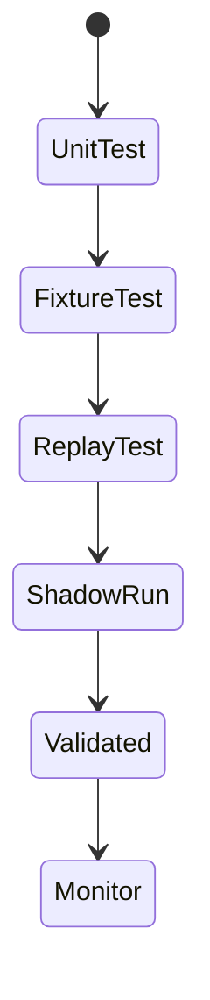

# MarketCell 评估与验证策略 v0.1

## 1. 为什么需要评估策略

MarketCell 不是普通业务系统，它会输出市场判断。

如果没有评估策略，系统很容易变成：

```text
看起来有很多分析
但不知道对不对
也不知道哪里错了
```

所以每个 Cell 和每次分析都必须可验证、可复盘。

## 2. 评估对象

MarketCell 要评估三层：

```text
Cell 级别
AnalysisReport 级别
系统长期表现级别
```

### 2.1 Cell 级别

评估单个 Cell 是否稳定。

例如：

- TrendCell 是否能正确识别简单趋势
- MarketRegimeCell 是否能区分趋势和震荡
- ManipulationRiskCell 是否能识别异常放量和长影线

### 2.2 AnalysisReport 级别

评估一次完整分析是否合理。

关注：

- 根节点方向是否和子节点一致
- 风险是否被正确保留
- 解释是否能追踪到证据
- 多个 Cell 冲突时是否输出 conflict 或风险提示

### 2.3 系统长期表现级别

评估系统长期是否有用。

关注：

- 高风险提示后，后续是否确实更容易剧烈波动
- 趋势判断后，后续是否有趋势延续
- 操纵风险提示是否经常误报
- 哪些 Cell 经常贡献错误信号

## 3. Cell 验证阶段



阶段说明：

- UnitTest：最小逻辑测试
- FixtureTest：固定样例测试
- ReplayTest：历史数据回放
- ShadowRun：只观察不参与决策
- Validated：可进入正式聚合
- Monitor：持续监控误判

## 4. 指标体系

### 4.1 方向类指标

适用于 TrendCell、NewsEventCell、DecisionCell。

- direction_accuracy
- bullish_precision
- bearish_precision
- conflict_rate
- neutral_rate

### 4.2 风险类指标

适用于 VolatilityCell、ManipulationRiskCell、LiquidityCell。

- risk_precision
- false_positive_rate
- false_negative_rate
- high_risk_followed_by_large_move_rate
- average_move_after_high_risk

### 4.3 解释类指标

适用于所有 Cell。

- evidence_coverage
- missing_evidence_rate
- stale_evidence_rate
- low_reliability_evidence_rate

## 5. 回放验证

当前每次使用 `--save` 分析时会保存：

```text
input_snapshot
cell_results
decision_result
formula_versions
created_at
```

建议使用 `AnalysisRun` 作为回放单位：

```text
AnalysisRun
├── input_snapshot
├── cell_manifests
├── formula_versions
├── cell_results
├── decision_result
└── report_id
```

回放时对比：

```text
当时判断
后续 1h / 4h / 1d 走势
风险是否兑现
是否出现误判
```

## 6. 操纵风险验证

操纵风险很难证明，所以不能用“是否真的操纵”作为唯一标准。

更合理的验证是：

- 高操纵风险后是否出现剧烈波动
- 是否出现快速拉升后回落
- 是否出现流动性突然变差
- 是否出现成交量和价格结构异常延续

ManipulationRiskCell 评估目标是识别异常风险，不是证明违法行为。

## 7. AI 解释层评估

AI 后期只负责解释结构化报告，不直接做最终判断。

AI 输出需要评估：

- 是否忠实于 CellResult
- 是否夸大结论
- 是否把风险说成确定性
- 是否遗漏关键证据
- 是否生成了不存在的数据

## 8. 当前 v0.2 验证要求

当前阶段每新增一个 Cell，至少要有：

- 1 个正常样例测试
- 1 个边界样例测试
- Manifest
- formula_version
- evidence 输出

当前阶段暂不做：

- 历史大规模回测
- 真实交易表现评估
- 自动交易验证

## 9. 进入 validated 的标准

一个 Cell 从 experimental 进入 validated，至少需要：

- 单元测试覆盖主要分支
- 固定样例稳定
- 历史回放结果可接受
- 有误判案例记录
- 有公式说明
- 没有绕过标准 CellResult

## 10. 评估底线

- 不能只看成功案例。
- 不能只看上涨行情。
- 不能把回测收益当成唯一标准。
- 不能忽略风险误报和漏报。
- 不能让 AI 替代结构化评估。
