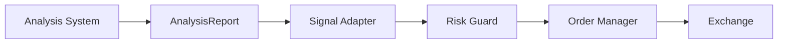

# MarketCell 风险治理文档 v0.1

## 1. 文档目的

MarketCell 会分析市场风险，但系统本身也必须有边界。

这个文档记录：

- 系统不能做什么
- 自动交易如何隔离
- 操纵风险如何表达
- API Key 和资金安全如何处理

## 2. 产品风险边界

MarketCell 输出的是结构化分析，不是投资建议。

禁止输出：

```text
保证上涨
保证下跌
确定有人操纵
必须买入
必须卖出
保证收益
```

推荐输出：

```text
偏多，但波动风险高
偏空，但置信度不足
操纵风险上升
多周期冲突
等待确认
```

## 3. 操纵风险表达

系统只能说“操纵风险”，不能说“确定操纵”。

原因：

- 市场操纵需要法律和监管定义
- 单一数据很难证明真实意图
- 分析系统只能识别异常模式

正确表达：

```text
ManipulationRiskCell 检测到异常放量、长影线和剧烈振幅，因此操纵风险升高。
```

错误表达：

```text
这个币一定被操纵了。
```

后续操纵风险 Cell 可以参考市场监管常见异常模式：

- Spoofing：虚假挂单后快速撤单
- Layering：多层虚假挂单制造压力
- Momentum Ignition：制造动量并诱导追单
- Wash Trading：刷量或对倒
- Pump and Dump：拉盘出货

## 4. 自动交易隔离

分析系统和交易系统必须隔离。



DecisionCell 不能直接下单。

任何下单前必须经过：

- 风险规则
- 仓位限制
- 资金限制
- 手动确认或策略授权
- 交易所状态检查

## 5. API Key 安全

后期接交易所时：

- API Key 不能写进代码
- API Key 不能提交到 Git
- 默认只使用只读权限
- 下单权限必须单独配置
- 提现权限永远不应该启用

第一阶段不接真实交易所，因此不需要交易 API Key。

## 6. 数据风险

市场数据可能存在：

- 延迟
- 缺失
- 异常值
- 交易所差异
- 新闻误报
- 社交媒体噪音

所以 Evidence 必须包含：

- freshness
- reliability
- source

## 7. 回测风险

后期回测必须注意：

- 不能偷看未来数据
- 不能忽略手续费
- 不能忽略滑点
- 不能忽略成交量限制
- 不能把历史拟合当成未来确定性

## 8. 系统治理原则

- 每个 Cell 必须可解释。
- 每个公式必须版本化。
- 每个重要报告必须可回放。
- 每个风险判断必须有证据。
- 自动交易模块必须独立设计。
