# MarketCell 运行时架构 v0.1

## 1. 目标

MarketCell 后续会同时处理实时行情和静态分析。运行时必须尽早分成两条路径：

```text
Rust Hot Path 负责动态数据
Python Cold Path 负责静态分析
Storage Layer 负责稳定交接
```

这样可以让高频数据接入保持低延迟，让 Cell 分析、复盘、报告保持可解释和可维护。

## 2. 总体结构

```mermaid
flowchart LR
    Provider["Professional Provider / Exchange Stream"] --> Hot["Rust Hot Path"]
    Hot --> Quality["Quality Gate<br/>dedup / gap / latency"]
    Quality --> Aggregation["Candle Aggregation<br/>feature precompute"]
    Aggregation --> Store["Storage Layer<br/>Parquet / DuckDB / cache"]
    Store --> Cold["Python Cold Path"]
    Cold --> Cells["AnalysisEngine / Cells"]
    Cells --> Report["AnalysisReport / Replay"]

    Store --> Replay["ReplayRunner"]
    Replay --> Cold
```



## 3. Rust Hot Path

Rust 负责动态数据和性能敏感边界。

适合放在 Rust 的内容：

- WebSocket / direct feed 连接和重连
- 交易逐笔、订单簿、实时 K 线聚合
- 延迟、缺口、重复、乱序检测
- 高频特征预计算
- 实时 source status 和 data quality warning
- 写入本地 cache、Parquet、队列或后续服务

不适合放在 Rust 的内容：

- 自然语言报告
- 产品策略解释
- Cell 决策文案
- 需要频繁研究调整的业务规则

当前代码落点：

```text
crates/market_data_core/   # 行情领域原语和低层质量函数
crates/realtime_core/      # 后续实时 worker / 聚合器预留
contracts/protobuf/        # 实时事件契约
```

## 4. Python Cold Path

Python 负责静态数据分析和研究效率。

适合放在 Python 的内容：

- AnalysisRequest / AnalysisReport
- Cell 编排和参考实现
- 决策策略、风险解释、报告生成
- 历史回放、公式对比、评估实验
- 数据商适配器的低频 backfill 和校验

不适合放在 Python 的内容：

- 高频 WebSocket 主循环
- 毫秒级实时聚合
- 大规模订单簿热点计算
- 自动交易风控热路径

当前代码落点：

```text
packages/python/src/market_cell/
├── data/       # 静态和低频数据接入协议
├── features/   # 可读参考特征实现
├── replay/     # 基于 input_snapshot 的重跑和漂移比较
├── reports/    # 报告和运行记录保存
└── cells/      # Cell 参考实现
```

本地历史查询通过 `data/storage.py` 提供可选 Parquet/DuckDB 适配。它仍然输出 `CandleBatch`，不会绕过 `AnalysisRequest` 和 Cell 协议。

数据源健康检查通过 `data/monitoring.py` 输出结构化质量问题，覆盖缺口、陈旧、异常量价和跨源偏差。当前在 Python 冷路径提供参考实现，后续 Rust 热路径可以输出同一类 `DataQualityWarning`。

质量问题持久化通过 `data/quality_store.py` 写入 JSONL 时间序列。它只记录数据健康状况，不参与 Cell 决策聚合。

健康摘要通过 `data/health.py` 聚合已记录问题，帮助选择主源和备源。当前摘要不等于完整 SLA，只作为源质量趋势的早期指标。

健康趋势同样位于 `data/health.py`，按小时或天聚合 JSONL 质量记录。后续 ProviderSelectionPolicy 可以读取这些趋势，但仍必须把最终 K 线数据转回 `CandleBatch` 和 `AnalysisRequest`。

## 5. Storage Layer

Storage Layer 是冷热路径的交接面，不应该让 Python 直接依赖 Rust 内部对象，也不应该让 Rust 直接调用 Python Cell。

推荐顺序：

1. JSON：当前 CLI、测试和报告保存。
2. Parquet：历史 K 线、聚合 K 线、特征快照。
3. DuckDB：本地研究查询和回放窗口选择。
4. PostgreSQL：服务化后的任务、报告、用户侧状态。
5. Redis：实时状态和短期缓存。

关键原则：

- 原始数据、聚合数据、分析报告分开保存。
- 每次分析必须有 input snapshot。
- 每批 K 线必须有 source provider、exchange、market type、fetched_at 和 quality flags。
- CI 和稳定性测试不能依赖外部行情 API。

## 6. 契约边界

```text
Realtime events  -> contracts/protobuf/market_data.proto
Historical batch -> contracts/parquet/candle_schema.md
Analysis input   -> contracts/json_schema/analysis_request.schema.json
Analysis output  -> contracts/json_schema/analysis_report.schema.json
```

跨语言模块只能围绕这些契约协作。Python dataclass 和 Rust struct 都是各自语言里的实现，不是跨语言的唯一真相。

## 7. 当前推进顺序

当前阶段优先做轻量、稳定、可测试的底座：

1. 明确冷热路径责任边界。
2. 建立 Protobuf / Parquet / JSON Schema 三类契约。
3. 建立 Rust market data domain primitives。
4. 建立 Python ReplayRunner，验证静态快照能稳定重跑。
5. 再推进 Parquet / DuckDB 和专业数据商 adapter。

暂不做：

- 微服务拆分
- 复杂消息队列
- PyO3 绑定
- 自动交易热路径

原因是当前最重要的是稳定领域模型和数据契约，而不是堆叠基础设施。
