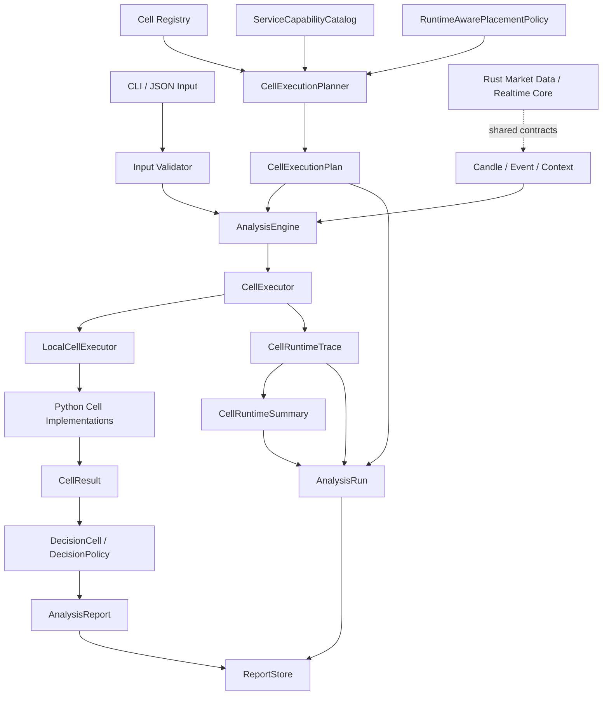

# MarketCell 系统架构基线 v0.3

## 1. 文档职责

本文只回答三个问题：

- MarketCell 的稳定系统边界是什么。
- 当前代码已经落到哪一层。
- 地基阶段还有哪些结构性缺口。

详细执行协议见 `cell_execution_fabric.md`，多语言边界见 `polyglot_architecture.md` 和 `runtime_architecture.md`，实施顺序只以 `roadmap.md` 为准。

## 2. 架构目标

MarketCell 不是指标集合，而是可组合、可追踪、可替换执行位置的 Cell 分析系统。

地基必须同时满足：

- 单机本地运行简单可靠。
- 一个 Cell 可以有多个实现和多个服务承载。
- 一个服务可以承载多个 Cell。
- Cell 组合关系与具体执行位置解耦。
- Python、Rust 和未来其他语言共享稳定契约。
- 每次分析、放置、执行、失败和输出都可以复盘。
- 分析系统与自动交易系统长期隔离。

## 3. 不可破坏的系统约束

```text
Cell 是能力，不是服务位置。
Graph 是组合关系，不是执行器实现。
ExecutionPlan 是一次运行计划，不是大数据载体。
Executor 负责真实执行，不能伪造服务归属。
CellResult 是稳定领域输出，不能混入调度细节。
AnalysisRun 是审计记录，AnalysisReport 是用户结果。
Rust 负责动态热点，Python 负责研究、编排和静态分析。
Trading Gateway 只能消费分析结果，不能反向污染 Cell。
```

## 4. 当前系统基线



当前运行仍是同步单进程，但 planner、binding、executor 和 trace 已经分层。这个阶段不引入消息队列或服务发现。

## 5. 分层和依赖方向

| 层 | 当前职责 | 允许依赖 | 不应承担 |
|---|---|---|---|
| Interface | CLI、JSON 输入输出 | Application、Contracts | 分析公式、服务放置 |
| Application | Engine、Planner、Replay、运行编排 | Domain、Execution、Storage ports | 具体指标公式 |
| Domain | Cell、Manifest、Result、Evidence、DecisionPolicy | 基础数据模型 | 网络、数据库、任务队列 |
| Execution | Catalog、Placement、Plan、Executor、Telemetry | Domain contracts | 用户报告语义、行情采集 |
| Data / Feature | 数据源、质量、缓存、基础特征 | Domain data contracts | Cell 决策聚合 |
| Infrastructure | 文件、Parquet、DuckDB、交易所、Rust 服务 | Ports、共享契约 | 修改领域输出语义 |

依赖方向应尽量由外向内。跨语言协作必须经过 `contracts/`，不能依赖某个 Python dataclass 的偶然结构。

## 6. 稳定对象和动态对象

### 6.1 稳定对象

这些对象应优先版本化并保持向后兼容：

- `AnalysisRequest`
- `CellManifest`
- `CellResult`
- `AnalysisReport`
- `AnalysisRun`
- `CellServiceBinding`
- `CellExecutionPlan`
- `CellRuntimeTrace`
- `CellRuntimeSummary`

### 6.2 动态对象

这些对象可以随运行状态变化，但必须留下审计结果：

- 服务能力目录快照
- placement decision
- executor 选择
- 服务健康和容量
- 重试、超时和降级
- 数据源路由

动态策略不能直接改变 CellResult 协议。

## 7. Cell 组合模型

MarketCell 的长期组合关系应分成三层：

```text
CellManifest       描述单个能力
CellGraphDefinition 描述 Cell 之间的依赖和组合
CellExecutionPlan  描述本次运行选择的实现和服务
```

`Organ` 应理解为一个有名称、有版本的 Cell 子图，而不是新的执行协议。多个 Organ 可以共享 Cell，也可以在一次分析中组合。

当前 `CellRegistry` 仍然使用“叶子 Cell 列表 + 一个 DecisionCell”生成固定 DAG。这适合本地闭环，但还不能表达任意 Organ、共享子图和多级聚合。因此后续应新增图定义契约，不能继续把组合关系塞进 Registry 列表。

## 8. Execution Fabric 当前状态

已经完成：

- `ServiceCapabilityCatalog`：表达一个 Cell 多服务、一个服务多 Cell。
- `RuntimeAwarePlacementPolicy`：按公式兼容、失败率、优先级和 P95 延迟选择 binding。
- `CellPlacementDecision`：记录候选和选择原因。
- `CellExecutor` / `LocalCellExecutor`：把执行从 AnalysisEngine 中拆出。
- ExecutionPlan v2：node_id 与 cell_id 分离，节点显式引用 binding_id。
- implementation、service 和 runtime 由 binding 单点定义，node 不保存重复副本。
- Plan / Graph Validator：检查 root、依赖、binding、环和可达性，并输出稳定拓扑层。
- plan、trace、CellResult 一致性校验。
- 成功和失败 AnalysisRun 的 trace / summary 审计。

仍未完成：

1. ExecutionPlan 还没有真正驱动 DAG 调度。Engine 当前仍按 Registry 顺序执行叶子 Cell，再执行根 Cell。
2. `input_keys` 只是描述字段，尚无 Input Resolver；服务化后不能继续把大体积 candles 直接嵌入任务计划。
3. 缺少 Executor Router，当前只有本地 Python executor。
4. Runtime summary 只有单次运行聚合，缺少跨运行、带时间窗口的历史存储。
5. 缺少性能预算和回归阈值，CI 目前只守功能正确性。

这些缺口应先于大规模新增业务 Cell 解决。

## 9. 数据和输入边界

当前 `AnalysisRequest` 直接携带 candles、events 和 context，适合本地分析和可复盘快照。

多服务阶段需要区分：

```text
Input Snapshot   可复盘的逻辑输入
Input Reference  executor 获取大数据的引用
Feature Snapshot Cell 消费的稳定特征
```

ExecutionPlan 只能保存引用、键和版本，不能复制大体积行情。Input Resolver 负责把引用解析为本地对象、共享存储窗口或远程数据流。

## 10. Python 与 Rust 边界

Python 负责：

- Cell 编排和参考实现
- 静态数据分析
- 策略和风险解释
- 历史回放与研究
- 契约参考实现

Rust 负责：

- WebSocket 和实时数据状态
- K 线动态聚合
- 订单簿和高频特征热点
- CPU 密集、低延迟 worker

语言选择由工作负载决定，不按模块名称机械划分。详细规则见 `runtime_architecture.md`。

## 11. 存储和审计边界

```text
AnalysisReport  用户结果
AnalysisRun     一次执行的完整审计
Raw / Candle    原始和标准化行情
Feature         可复用特征快照
Runtime State   服务健康、容量和短期状态
```

这些数据必须分开存储和设置生命周期。报告不能成为运行日志，运行 metadata 也不能成为业务输出字段的垃圾桶。

当前文件存储是参考实现；后续 PostgreSQL、Parquet、DuckDB 或 Redis 只能替换存储适配器，不能改变领域契约。

## 12. 扩展性和性能约束

未来大量 Cell 运行时必须遵守：

- DAG 中无依赖节点可以并行，但结果排序和聚合必须确定性。
- executor 必须声明支持的 runtime、并发和批处理能力。
- 调度必须有超时、重试、背压和熔断边界。
- 同一 run / node 的执行需要幂等标识，避免重试产生重复结果。
- placement 不能只看平均耗时，应使用样本量、失败率和尾延迟。
- 远程执行必须传播 trace_id、run_id、plan_id 和 parent_span_id。
- 任何性能优化都不能绕过公式版本、输入哈希和结果契约。

## 13. 文档导航

| 问题 | 权威文档 |
|---|---|
| 产品目标和边界 | `product_design.md` |
| 当前系统基线 | `system_architecture.md` |
| Cell 开发协议 | `cell_protocol.md` |
| Cell 多服务执行 | `cell_execution_fabric.md` |
| 后端服务化 | `backend_architecture.md` |
| Python / Rust 分工 | `runtime_architecture.md` |
| 多语言仓库和契约 | `polyglot_architecture.md` |
| 数据字段 | `data_contract.md`, `contracts/` |
| 稳定性要求 | `stability_design.md` |
| 实施顺序 | `roadmap.md` |
| 历史设计记录 | `design_review.md` |

## 14. 地基退出标准

进入大规模 Cell 扩展前，至少应满足：

- Plan / Graph Validator 能拒绝非法 DAG。（已完成）
- 本地执行顺序由 ExecutionPlan 驱动，而不是 Registry 固定循环。
- Input Reference / Resolver 边界确定。
- Runtime summary 可以跨运行聚合并进入 placement。
- 有最小性能基线和回归阈值。
- 失败运行、重试和降级都有可复盘记录。

具体实施顺序只维护在 `roadmap.md`。
