# MarketCell 系统架构文档 v0.2

## 1. 架构目标

MarketCell 的架构目标是构建一个可解释、可扩展、可回放的市场分析后台系统。

第一阶段只做后台分析闭环，不做界面，不做自动交易。

架构必须支持未来扩展到：

- 多资产
- 多周期
- 多数据源
- 因子图
- AI 解释
- 实时分析
- 自动交易前置系统

## 2. 总体架构图

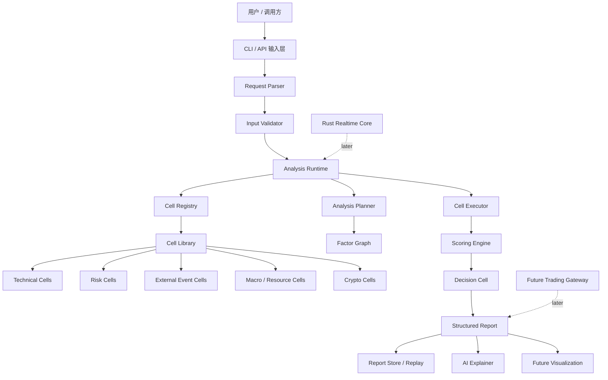

当前已经实现：

- 多语言 workspace 初版：`packages/python`、`crates`、`contracts`
- CLI 输入层
- Request Parser
- Input Validator
- Cell Registry
- 固定 Cell 执行器
- Scoring Engine 初版
- DecisionCell
- DecisionPolicy 策略层
- EventBus
- AnalysisRun / Recorder 初版
- FileSystemReportStore
- ReplayRunner
- JSON Report v1
- JSON Schema 契约
- Protobuf 行情事件契约
- Parquet K 线批量存储契约
- Rust market_data_core 行情原语
- Rust realtime_core 预留

未来实现：

- Analysis Planner
- Factor Graph
- Data Connector / Feature Store
- AI Explainer
- Visualization
- Trading Gateway

## 2.1 外部成熟系统吸收点

MarketCell 吸收成熟交易和量化系统的架构经验，但不照搬。

| 来源 | 值得吸收 | MarketCell 中的落点 |
|---|---|---|
| QuantConnect LEAN | 数据、算法、交易、结果处理分离 | Data Layer、Cell Runtime、Report Store 分离 |
| NautilusTrader | MessageBus、DataEngine、RiskEngine、ExecutionEngine | EventBus、Risk Cell、未来 Trading Gateway |
| Freqtrade | 简单清晰的策略生命周期 | 当前阶段保持同步 CLI 和简单 Engine |
| Hummingbot | Connector 和订单状态跟踪 | 后期 Exchange Adapter、Order State Tracker |
| Backtrader | Data Feed、Strategy、Analyzer、Observer | Data Connector、Cell、ReportAnalyzer、Observer |
| vn.py | EventEngine、Gateway、App 插件化 | 后期 EventBus、Connector、App 模块 |
| Qlib | Recorder、Feature Store、研究工作流 | AnalysisRun、Feature Store、EvaluationStore |
| 市场监管 | Spoofing、Layering、Wash Trading 等异常模式 | Manipulation Risk Cell 族 |

核心结论：

```text
MarketCell 不能只是 Cell 列表。
它需要逐步演进为 Data + Event + Cell + Report + Replay 的分析系统。
```

## 3. 分层架构

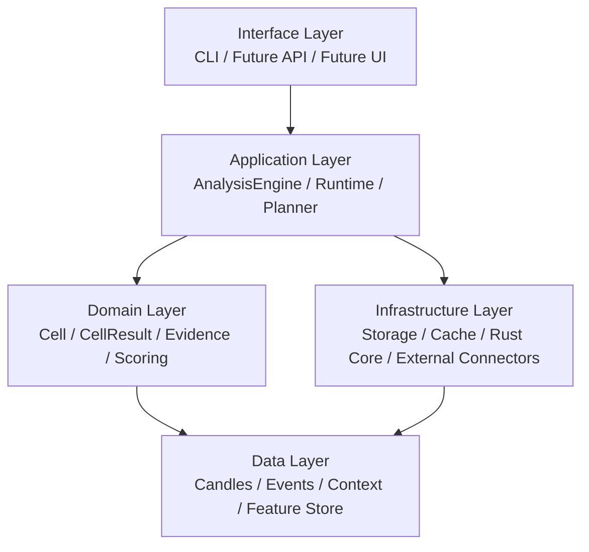

### 3.1 Interface Layer

负责接收输入和输出结果。

当前：

- CLI
- JSON 输入
- JSON 输出

后期：

- FastAPI
- WebSocket
- 可视化界面
- 自动交易系统调用入口

### 3.2 Application Layer

负责任务编排。

当前：

- AnalysisEngine
- 固定 Cell 列表执行
- DecisionCell 聚合

后期：

- AnalysisPlanner
- 多周期任务拆分
- 任务并发执行
- 回放任务
- 定时任务

### 3.3 Domain Layer

系统的核心领域模型。

包括：

- Cell
- CellManifest
- AnalysisRequest
- CellResult
- Evidence
- AnalysisReport
- Scoring

这一层必须稳定。后面无论接什么数据源，都不能破坏核心协议。

### 3.4 Data Layer

负责市场数据和外部事件数据。

当前：

- Candle
- MarketEvent
- context

后期：

- OrderBookSnapshot
- TradeTick
- FundingRate
- OpenInterest
- OnChainFlow
- MacroEvent
- NewsArticle

### 3.5 Infrastructure Layer

负责外部系统和性能模块。

后期包括：

- DuckDB
- Parquet
- PostgreSQL
- Redis
- 交易所 API
- 新闻 API
- 链上数据 API
- Rust realtime_core

## 4. 运行流程

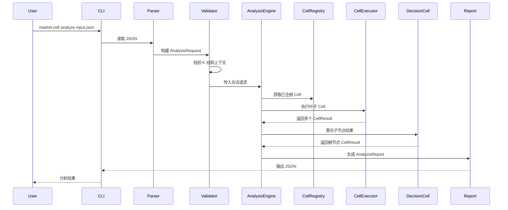

## 5. 核心领域模型

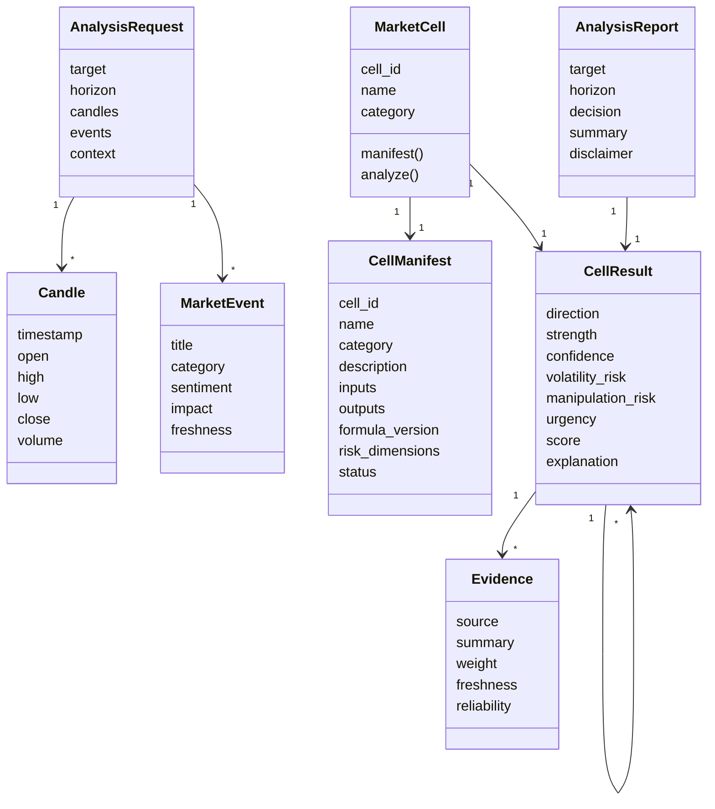

## 6. Cell 系统架构

Cell 是 MarketCell 的最小分析单元。

每个 Cell 都必须遵守统一协议：

```text
analyze(request, child_results) -> CellResult
```

### 6.1 Cell 分类

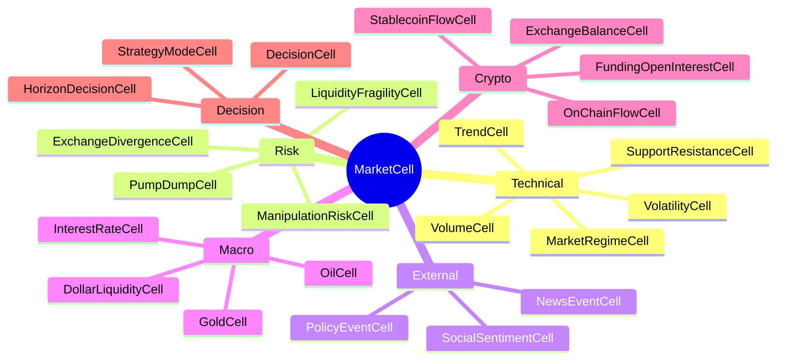

### 6.2 Cell 生命周期

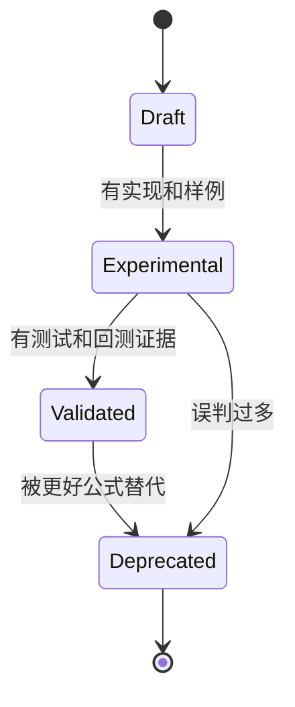

生命周期含义：

- Draft：只有想法或草稿
- Experimental：可以运行，但还没充分验证
- Validated：经过测试、样例、回放验证
- Deprecated：保留兼容，但不推荐继续使用

## 7. 因子图和分析树

MarketCell 长期不能只用固定树。

现实市场是网状影响关系：

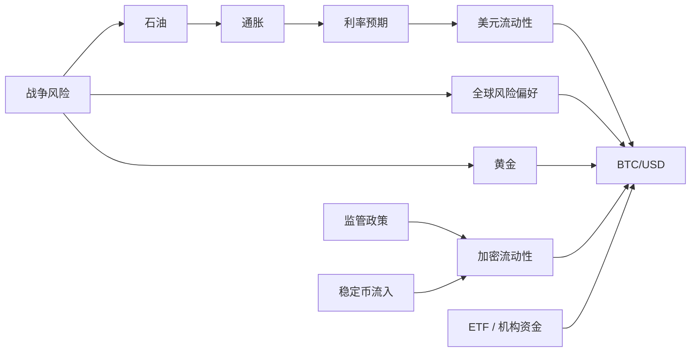

底层应该保存为 Factor Graph。

一次分析任务再从图里抽取 Analysis Tree：

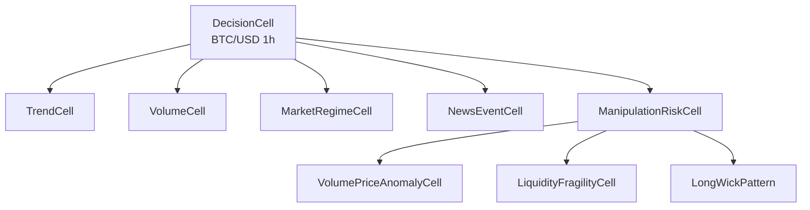

这就是：

```text
Factor Graph 负责表达世界关系
Analysis Tree 负责一次任务怎么执行
```

## 8. 数据流

```mermaid
flowchart LR
    Raw["Raw Data<br/>交易所 / 新闻 / 链上 / 宏观"] --> Normalize["Normalize<br/>标准化"]
    Normalize --> Validate["Validate<br/>校验"]
    Validate --> Feature["Feature Engine<br/>特征计算"]
    Feature --> Request["AnalysisRequest"]
    Request --> Cells["Cell Execution"]
    Cells --> Results["CellResults"]
    Results --> Decision["DecisionCell"]
    Decision --> Report["AnalysisReport"]
    Report --> Store["Report Store"]
    Store --> Replay["Replay / Review"]
```

当前 v0.2 从 AnalysisRequest 开始。

真实数据接入后，前面会增加：

- collector
- normalizer
- feature engine
- storage

## 9. 评分和聚合模型

第一版评分必须可解释。

方向值：

```text
bullish = 1
bearish = -1
neutral = 0
conflict = 0
```

子节点分数：

```text
score = direction_value * strength * confidence / 100
```

父节点聚合：

```text
weighted_score = Σ child.score * child.weight
final_score = weighted_score / Σ child.weight
```

风险单独聚合：

```text
volatility_risk = max(child.volatility_risk)
manipulation_risk = max(child.manipulation_risk)
urgency = max(direction_strength, volatility_risk, manipulation_risk)
```

重要原则：

```text
方向不等于风险
信号不等于仓位
分析不等于下单
```

## 10. 操纵风险子系统

操纵风险是 MarketCell 的核心差异之一。

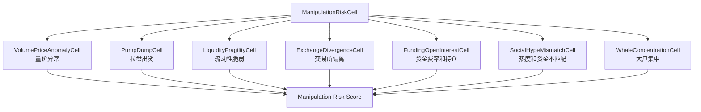

输出原则：

- 输出“操纵风险”
- 不输出“确定操纵”
- 每个风险必须有证据
- 风险判断必须保留置信度

## 11. Python 和 Rust 边界

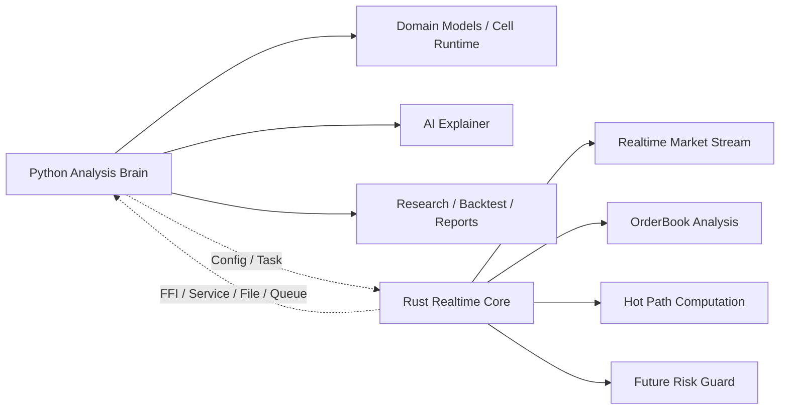

当前策略：

- Python 实现分析系统主体
- Python 负责静态分析、研究、回放和报告解释
- Rust 负责动态数据、实时聚合和性能热点
- Rust 先以 `market_data_core` 稳定行情原语，再演进实时 worker
- 不急着跨语言调用

未来 Rust 适合迁移：

- 订单簿计算
- 高频波动检测
- 实时数据流
- 大规模指标热点
- 自动交易风控核心

更详细的冷热路径边界见 `runtime_architecture.md`。

## 12. 存储架构规划

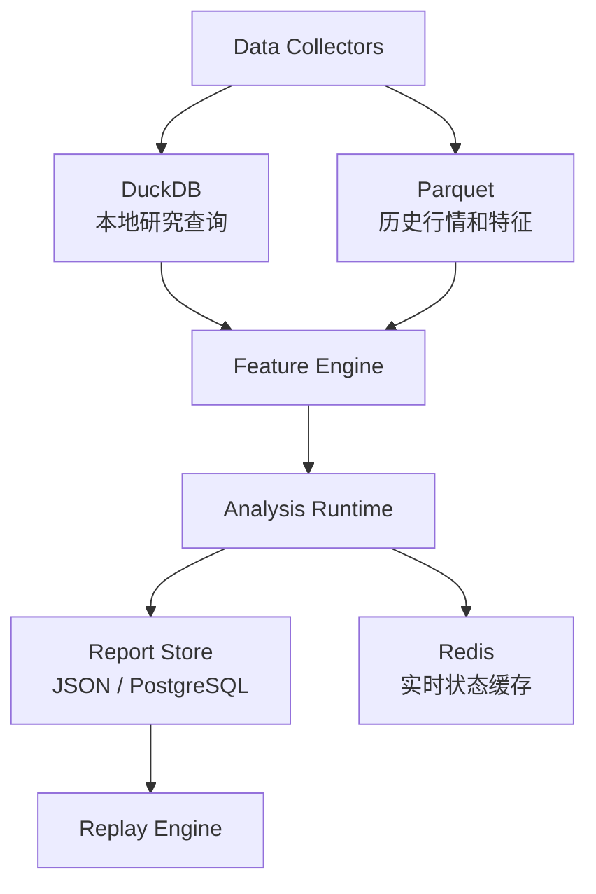

阶段选择：

- v0.2：不接数据库，只用 JSON
- v0.5：Parquet + DuckDB
- v0.8：PostgreSQL 保存任务和报告
- v1.0：Redis 支持实时状态

## 13. 后期服务化架构

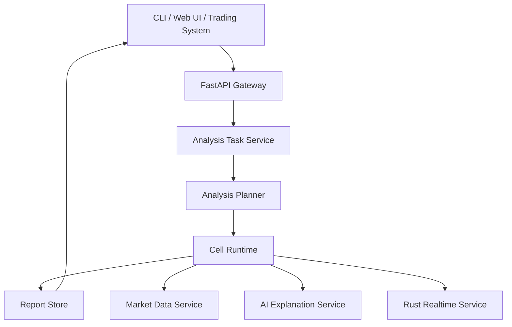

服务化后，CLI 只是其中一个客户端。

## 14. 目录结构规划

当前结构：

```text
market-cell/
├── contracts/
│   └── json_schema/
├── docs/
├── examples/
├── packages/
│   └── python/
│       ├── src/market_cell/
│       │   ├── cells/
│       │   ├── policies/
│       │   ├── reports/
│       │   ├── cli.py
│       │   ├── engine.py
│       │   ├── models.py
│       │   ├── registry.py
│       │   ├── scoring.py
│       │   └── validation.py
│       └── tests/
└── crates/
    ├── market_data_core/
    └── realtime_core/
```

Python 包内部后期结构：

```text
packages/python/src/market_cell/
├── api/
├── app/
├── cells/
├── data/
├── features/
├── graph/
├── runtime/
├── replay/
├── reports/
├── storage/
└── ai/
```

## 15. 架构演进路线

### v0.2 当前目标

- 完整产品文档
- 完整系统架构文档
- Cell Manifest
- 输入校验
- Cell Registry
- MarketRegimeCell

### v0.3 Cell 扩展

- SupportResistanceCell
- BreakoutCell
- LiquidityCell
- FundingOpenInterestCell

### v0.4 多周期分析

- MultiHorizonRequest
- HorizonDecisionCell
- 多周期冲突判断

### v0.5 数据接入

- 交易所 K 线
- 本地缓存
- Parquet / DuckDB

### v0.6 回放系统

- 保存每次分析
- 回放历史输入
- 对比后续真实走势

### v0.7 AI 解释层

- AI 解释报告
- AI 总结冲突
- AI 生成复盘

### v1.0 自动交易前置

- Trading Gateway
- Risk Guard
- Position Manager
- Order Manager
- Exchange Adapter

## 16. 关键架构原则

1. 分析和交易分离
2. 方向和风险分离
3. 证据和结论绑定
4. Cell 可以独立测试
5. 公式必须版本化
6. 输入必须先校验
7. 报告必须可回放
8. Rust 只负责高性能边界，不抢 Python 的研究效率
9. AI 负责解释和辅助，不直接替代规则系统
10. 系统先稳定，再复杂
